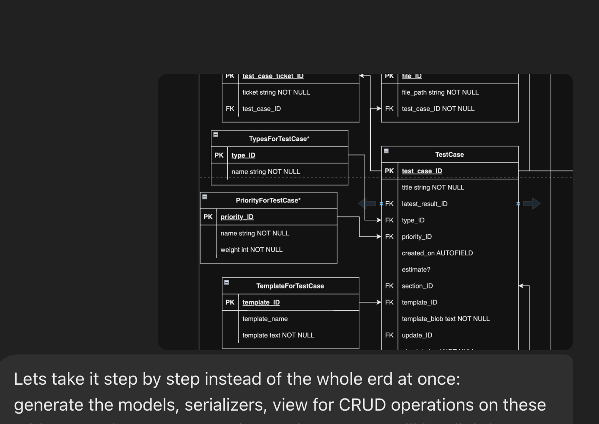

# BACKEND README

## Authentication and Authorization
We will use django [authemail](https://gitpip install django-rest-authemailhub.com/celiao/django-rest-authemail).
Read the github readme fully. It covers everything we will be using.
Some points to note:
- Please change the password in settings.py for email notifications (and do not expose it in your commits). To generate password for your gmail, go to google > manage my account and search app passwords. Generate the key and copy and paste (remove spaces, should be 16 characters) it there (better to use it as env variable)
- Can verify the working by going to [http://localhost:8000/api/accounts/signup/](http://localhost:8000/api/accounts/signup/) and [http://localhost:8000/api/accounts/login/](http://localhost:8000/api/accounts/signup/).

## File Structure
- Note that we have broken down the models, serializers and views files into folders for better structure. For example, models.py is broken down into different files stored in models folder now. This is same but better to maintain the codebase.

## CRUD Operations
- I have tried to make design such that the coding is straightforward. This may mean slightly less efficient in some scenarios but more maintainable code. This will be the strategy till the application is fully developed. For example. I have provided separate CRUD operations for TestCaseFiles and TestCase. Even though TestCaseFiles can be embedded in the same request as TestCase, I have done it more straightforwardly that is instead of a complex single request, there are two requests, first to create the test case and then upload files.

## TODO
- The models contain part of the ERD, that is only the part of the testcases. If you look closely a lot of foreign keys are not defined as foreign keys since there tables are not added. Your tasks involves two things, first add those tables in the same manner (models, views, serializers) and then connect the dots between the models (wherever needed). You should definitely use chatgpt for this  Don't rely on it for correctness!

- Write test cases for everything, db tables (including all the assumptions there are). You have to explore other kinds of testing.
