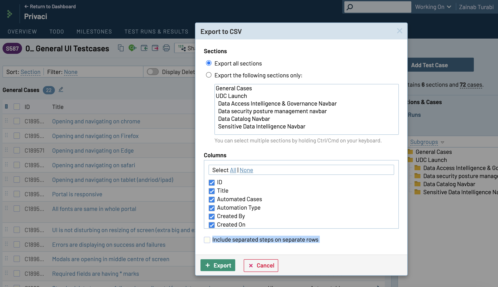
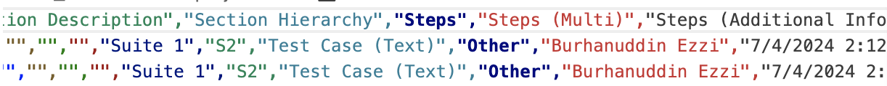

# MIGRATING DATA FROM TESTRAIL

## BEFORE MIGRATING
Before you migrate your data from testrail, you need to make sure you have staff/admin access to the TCMS application. The first thing you will do is make a superuser on the TCMS site.

### Create an entry for the Project that you are migrating in the admin site
Go to the admin site > Projects > Add a new Project

## MIGRATING TESTSUITES AND TESTCASES
- Go to Testrail > Projects > (The project you want to migrate) > TestSuite & TestCases > Export > To CSV. After doing this a dialogue box will open. Make sure to unselect the option "Include separated steps on separate rows". Also make sure that you have selected all of the Colums. A sample is shown below 
- You will have to edit the CSV file since the resulting file will have two Columns with same name. See the first line of CSV file. There are two Colums with the name "Steps". Edit the second Column "Steps" to "Steps (Multi)". Refer to the image shown below  You can also open CSV files in editors like Excel.
- Go to admin site > Files > Add. Here you will upload the CSV file. Then after uplaoding you will can select the file and click on the operation "Import TestSuites and Cases from these file(s)".
- Note that the file will contain names for users that have created or updated the data. This tool will check if people with the same names are already in the DB, if not there entries will be created in the DB with their email being \<firstname\>\<lastname\>@example.com. The superuser have two options, ignore these user entries, this will have no effect on the application as these users will be treated as non-active users and will not have any password assigned to them